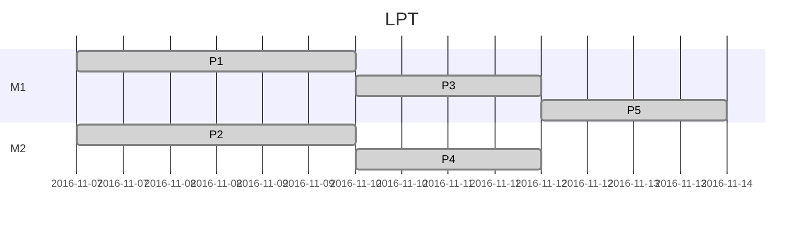
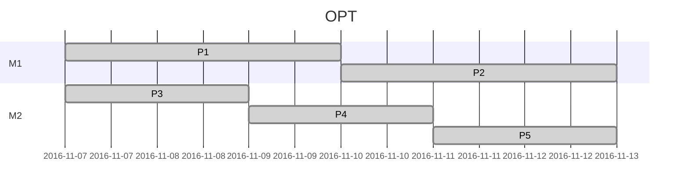
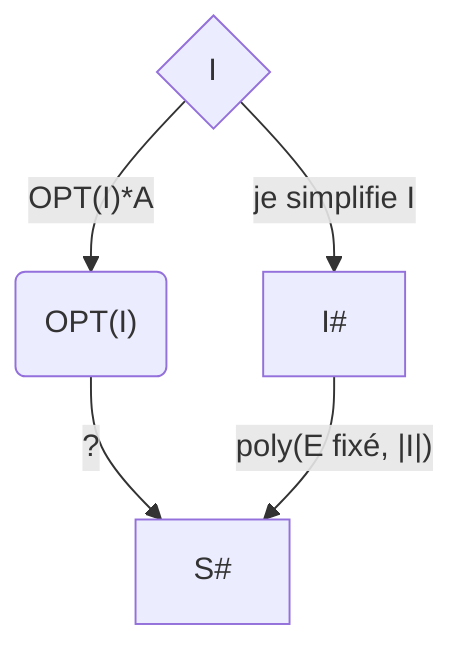
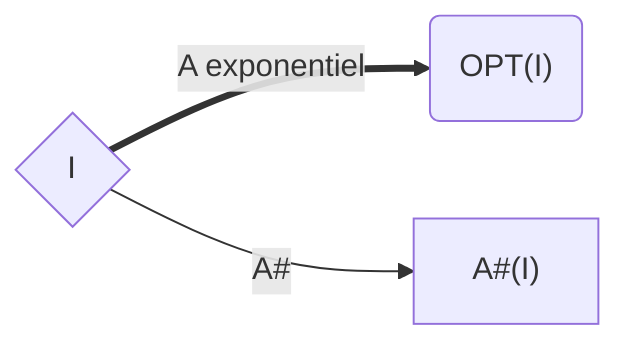
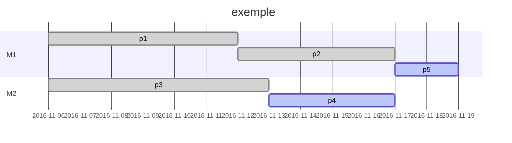

# Algorithmique avancée

[Cour en ligne_(anglais)_](http://ejc-gdr-ro.event.univ-lorraine.fr/docs/kacem.pdf)

[TOC]

## Chapitre 1, Introduction générale

Dans cette UE, l'objectif est d'apprendre quelques outils/techniques algorithmiques permettant de résoudre des problèmes (essentiellement des problèmes de la classe **NP**). 

**Structure des problèmes**

$\Omega(\Pi)$ :espace des solutions pour $\Pi$  

Souvent, on s'intéresse à trouver une ou plusieurs solutions dans $\Omega(\Pi)$ selon un ou plusieurs critères (fonction objectif)

Si $|\Omega(\Pi)|$ est "*limité*" on peut tout explorer (méthode exhaustive/brutal). Mais souvent $|\Omega(\Pi)|$ peut être grand. On parle dans certains cas d'une taille "*exponentielle*". Dans ce cas, la méthode exhaustive atteint ses limites. Elle est incapable de tout explorer en un temps "*raisonnable*".

__Mais c'est quoi un temps raisonnable ?__

- Algotithme polynomial => OUI
- Autre algo (*e.g exponentiel*)=> NON

### I Définitions:

#### I.1 Instance

> Une instance $I$ du problème $\Pi$ peut être obtenue en remplaçant les paramètres de $\Pi$ par des valeurs données.  

$$
**\Pi :\text{Problème voyageur de commerce} \\ 
\,\\
\text{N : nombre de ville à visiter}\\
d_{i,j}\text{: distance entre les villes i et j}\\
$$
> Ici, on cherche à trouver une permuttation (trajet) permettant de miniser $f$ distance totale
>
> => $\Omega(\Pi)$  : l'ensemble de permuttations
>
> On peut remarquer que $\Omega(\Pi)$ est bien __fini__ mais $|\Omega(\Pi)|$ est exponentiel car $|\Omega(\Pi)|=N!\rightarrow|\Omega(\Pi)|$ est exponentiel  

##### Exemple

 C'est un *"exemple"* du problème $\Pi$

$I$:

- N = 5
- Ville = {Paris, Metz, Nancy, Bordeaux, Marseille}
- Distances:
  - $d_{1,2} = 360$
  - $d_{1,3}$
  - $d_{1,4}$
  - $\cdots$
  - $d_{4,5} = 500$

#### I.2 Taille d'une Instance I

> La taille d'une instance $I$ est le nombre de bits nécessaire à la représentation de cette instance. On peut noter cette taille par $|I|$.

##### Exemple

$ log(N)+\sum_{i\neq j}log(d_{i,j}) $

Si $ d_{i,j}\leq D_MAX $

Alors $|I|=log N + O(N^2 \log(D_\mathrm{MAX})) \approx O(N^2 \log(D_\mathrm{MAX}))$

#### I.3 Complexité d'un algorithme A

> C'est le nombre d'instruction nécessaire à l'execution d'un algorithme A, exprimé en fonction de la taille de l'instance.

##### Exemple

$\Pi$ Est-ce que l'entier $x$ est premier ?

=> Taille d'une instance $I$  est $log(N)$

_Algorithme_

```c++
int k;
for(k = 2; k < n-1 ;n++) {
    if (k divise n) {
        return false;
    }
}
return true;
```

Nombre d'instruction $=O(n)=O(e^{|I|})$


#### I.4 Algorithme polynomial:

> Si la complexité d'un algorithme est *bornée* par une fonction polynôme alors cet algorithme est polynomial.

##### Exemple

$\Pi$ : tri d'un tableau à $N$ éléments $a_1a_2,\cdots,a_N$

&rarr; Taille de l'instance: $log(N)+\sum_{i=1}^{N}log\, a_i=O(Nlog(max_{i\in\{1\cdots N\}}\,a_i))=O(Nlog(\text{A_MAX}))$

Algorithme d'échange classique: on procède en échangant deux élements si ces deux données sont mal ordonnées $\implies$ $O(N²)$ 

&rarr; Complexité = $O(N²)=O(|I|²)$

> On a des problèmes pour lesquels on possède des algorithmes polynomiaux ($\in P$ *problème polynamiaux*).
> Et il y a les autres problèmes.
> Pour ces derniers on peut évoquer la class $NP$ pour lesquels la vérification de la <u>faisabilité</u> de la solution se fait en un temps polynomial.  

$$
\implies P \subseteq NP
$$

------

### II. Programation dynamique

[référence](http://www.unit.eu/cours/EnsROtice/module_me/co/Mon_Module.html)

#### II.1 Principe de Belleman

La programation dynamique s'appuie sur le __principe de Belleman__

$[CB]$ cette portion est optimale car si $[CB]$ n'est pas optimal, alors il doit y avoir un autre chemin $[CB]^{\approx}$ qui est plus court que $[CB]\Rightarrow[AC]\cup[CB]^{\approx}$ est plus court que $[AB]$ 

__ABSURDE__

##### conclusion

> Le principe de __Belleman__ montre bien que l'on peut résoudre un problème en faisant appel aux solutions (_partielle_) qui correspondent aux niveaux inférieurs.

##### Exemple sac-à-dos

Un sac de volume $V_{max}$

$N$ objets:

- une utilité $P_i$
- un volumen $v_i \leq V_{max}$

L'objectif est de selectionner un ensemble d'objets pouvent rentrer dans le sac-à-dos avec une utilité maximal.

:arrow_right: Volume d'objet selectionnés $\leq V_{max}$

​	Maximiser $\sum_{i=1}^{N}x_iP_i$

​	sc. $\sum_{i=1}^{N}\leq V_{max}$

​	$x_i\in{0,1}\,\forall i=1,2,\cdots,N$

On définie un problème d'ordre général:

$\Pi(k,v)$: le problème de sac-à-dos correspond aux k premier objets à insérer dans le sac de valeur v

Notre problème initial correspond à $\Pi(N,V_{max})$

Soit $F(k,v)$ la valeur de l'utilité optimal par le problème $\Pi(k,v)$


Etat = solution potentielle $\Leftrightarrow$ Placement de $k$ premiers objet dans le sac

$k=0,1,2,\cdots,N$ les solutions finales se trouvent dans $\chi_N$
$$
[v,w]\in\chi_k 
\left\{
\begin{array}{ll}
[v+v_{k+1},w+w_{k+1}]\text{ si }v_{k+1}\leq V_{max}\\
[v,w]
\end{array}
\right.
$$

###### Algorithme

$$
\begin{align}
&\chi_o=\{[0,0]\}\\
&pour\,k=1,2,\cdots,N\\
&\quad\chi_k=\emptyset\\
&\quad pour\,chaque [v,w]\in\chi_{k-1}\\
&\quad\quad ajouter[v+v_k,w+w_k]\,à\,\chi_k\text{ si }v+v_k\leq V_{max}\\
&\quad\quad ajouter[v,w]\,à\,\chi_k\\
&\quad finpour\\
&finpour\\
&supprimer \chi_{k-1}\\
\end{align}
$$

###### Relation de dominance

Si $[v,w]$ et $[v,w']\in\chi_k$, alors on peut supprimer $[v,w']$ si $w'\leq w$ :arrow_right: Pour un seul $v$, on a un seul etat, celui ayant le $w$ le plus grand.

-  Si $V_{max}$ et borné :arrow_right: DP est polynomial

- si $V_{max}=\exp(N)$ alors DP est $\exp$

  :arrow_right: <u>DP est pseudo-polynomial</u>

-----

## Chapitre 2, Approximation polynomiale

### I.Introduction

#### I.1 Notation

- $\Pi$ problème <u>d'optimisation NP-difficile</u>
- $f$ fonction objectif de $\Pi$ _(sans perte de généralité, on considère que l'on cherche à minimiser $f$)_
- $I$ instance du problème $\Pi$
- $OPT[I]$ une solution optimal de $I$
- $H$ algorithme permettant la résolution de $\Pi$ _(on s'intéresse à des algorithme approché et polynomiaux)_
- $H(I)$ solution donnée par $H$ pour l'instance $I$
- $\omega(\Pi)$ l'ensemble des instance du problème $\Pi$
- $\rho(H)$ ratio de performance de $H$ pour le problème $\Pi$


#### I.2 Ratio de performance

- $\rho(H)=max_{I\in\omega(\Pi)}\left\{\frac{f(H(I))}{f(OPT(I))}\right\}$	

- :arrow_right: $\rho(H)\geq1$ pour tout $H$

L'idéal est de trouver un algorithme $H$ avec un $\rho(H)$ proche de 1. Si $\rho(H)$ est une constante, on dit que $H$ est une __approximation constante__, une __$k$-approximation__ avec $k=\rho(H)$.  Si $\rho(H)$ varie en fonction de $|I|$, l'approximation n'est pas constante

#### I.3 Schémas d'approximation

C'est un schémas algorithmique avec un paramètre $\varepsilon>0$ permettant de retourner un algorithme $(1+\varepsilon)\text{-approximation}$. Il y a deux type de schémas possible:

##### I.3.a PTAS (Polynomial Time Approximation Scheme)

- __Condition__: $(1+\varepsilon)\text{-approximation}$ 
- Complexité(PTAS) = Poly($|I|,\epsilon$ fixé) ex: $O(N.2^{1/\varepsilon}$)

##### I.3.b FPTAS (Fully PTAS) _Plus puissant_

- PTAS
- Complexité(FPTAS) = Poly($|I|, \frac{1}{\varepsilon}$) ex: $O(N²/\varepsilon³)$ 


###### I.3 Exemple (n tâches sur 2 machines)

$\Pi$ problème sur 2 machines/processeurs identiques. L'objectif est de minimiser la date de fin de la dernière tâche executé.

On a un ensemble $\{1,2,\cdots,N\}$ de tâches que l'on veut répartir sur $M_1$ et $M_2$

Chaque tâche $i$ possède une durée opératoir $p_i$

###### H On place toutes les tâches sur une seule machine.

$\Rightarrow f(H)=\sum_{i=1}^{N}p_i$

$f(OPT)\geq\frac{\sum_{i=1}^{N}p_i}{2}$

$\Rightarrow f(H) \leq 2.f(OPT)\Rightarrow H$ est un 2-approximation

Le ratio est atteint car sinon prend une instance à 2 tâches $p_1=p_2=p$, alors $f(H)=2p$ et $f(OPT)=p\Rightarrow\rho(H)=2$

###### H2 stratégie amélioré: __LPT__*(longest processing time)*

- On trie les tâches selon _LPT_ telque $p_1\geq p_2\geq p_3 \geq\cdots\geq p_N$.
- On place les tâches dans l'ordre _LPT_ en choisissant toujours la machine la moins chargé.

<u>Observation</u>:

- _LPT_ est optimal pour $N=1,N=2,N=3,N=4$
- _LPT_ n'est pas optimal pour $N=5$

_contre exemple_

__LPT__






<u>Preuve</u>

- $z$ indice de la dernière tache
- $\beta$ date de fin de la machine 1
- $\alpha$ date de fin de la machine 2 - durée de la tache Z
- $c_{LPT}$ date de fin de la machine 2

$$
\begin{align*}
&OPT\ge\frac{P}{2}=\frac{\beta+C_{LPT}}{2}&(1)\\
&\alpha\le\beta&(2)\\
\\
&C_{LPT}-OPT\le(\alpha+P_z)-(\frac{\beta+C_{LPT}}{2})\\
\implies &C_{LPT}-OPT\le\alpha+p_z-\frac{\beta}{2}-\frac{C_{LPT}}{2}\\
&=\alpha+p_z-\frac{\beta}{2}-\frac{(\alpha+p_Z)}{2}\\
&=\frac{\alpha}{2}+\frac{p_z}{2}-\frac{\beta}{2}\\
&\le\frac{p_z}{2}&(3)\\
\end{align*}
$$

> Il faudrait trouver une relation entre OPT et $p_z$

On prend en considération les tâches $1,2,\cdots,z$
$$
\begin{align*}
&OPT=OPT(1,2,\cdots,N)\ge OPT(1,2,\cdots,Z)\\
&OPT(1,2,\cdots,Z)\ge\big[\frac{z}{2}\big]\cdot p_z&(4)\\
\end{align*}
$$


_<u>Observation 1</u>_ Une machine exécute au moins $[\frac{z}{2}]$ tâches

_<u>Observation 2</u>_ $\forall i=1,2,\cdots,Z$ on a $p_i\ge p_z$ (selon LPT)
$$
\text{(3) et (4)}\implies
\left\{
\begin{array}{ll}
c_{LPT}-OPT\le\frac{p_z}{2}\\
OPT\ge[\frac{z}{2}]\cdot p_z\implies\frac{1}{OPT}\le\frac{1}{[\frac{z}{2}]\cdot p_z}
\end{array}
\right.
\implies
\left\{
\begin{array}{ll}
\frac{C_{LPT}-OPT}{OPT}\le\frac{p_z}{[\frac{z}{2}]\cdot p_z}\\
\end{array}
\right.
$$
$(*)\frac{C_{LPT}-OPT}{OPT}\le\frac{1}{6}\implies c_{LPT}-OPT\le\frac{OPT}{6}\implies c_{LPT}\le\frac{7}{6}OPT$


### II. Schémas d'approximation (PTAS, FPTAS)

#### II.1. Un PTAS pour le problème 2||Cmax

Le cadre général ?

<u>Modification de l'instance $I$</u>
- Je dispose d'un algorithme exact $A$ exponentiel



<u>Modification d'un algorithme exact $A$</u>



$A^{\#}(I)$ s'exécute aussi en respectant la même conditions sur la complexité.


##### II.1.a PTAS pour le problème 2||Cmax

PTAS: ($\varepsilon>0$ donnée)

1. Diviser l'ensemble des tâches
   - $G=\{i|p_i>\varepsilon\cdot p/2\}$ _tâches longues_
   - $S=\{i|p_i\le\varepsilon\cdot p/2\}$
2. Énumérer toutes les affectations possible des tâches de $G$ sur les deux machines _le nombre de ces affectations est = $2^{|G|}$_
3. Chaque affectation de $G$ (_trouvé dans l'étape (2)_) doit être complétée par les tâches de $S$: Toujours sur la machines la moins chargée



4. Retourner la meilleure solution parmi celles générées dans l'étapes (3)

> <u>Observation</u> durée total des tâches = P 
>
> N'importe quelle tâche $i\in G$ vérifie $p_i\ge\varepsilon\cdot p/2$
>
> $\implies|G|\le[\frac{p}{(\varepsilon\cdot p/2)}]\approx 2/\varepsilon\implies |G|\approx O(2/\varepsilon)$

__Complexité de PTAS = $O(N\cdot2^{2/\varepsilon})$__


